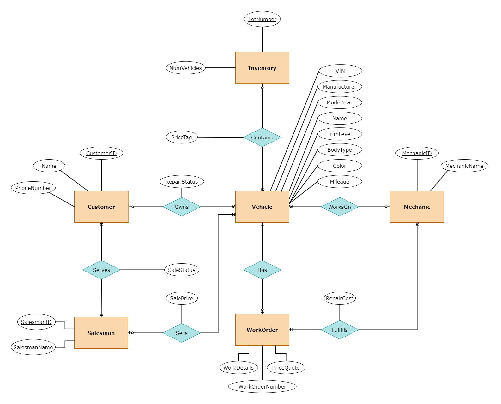
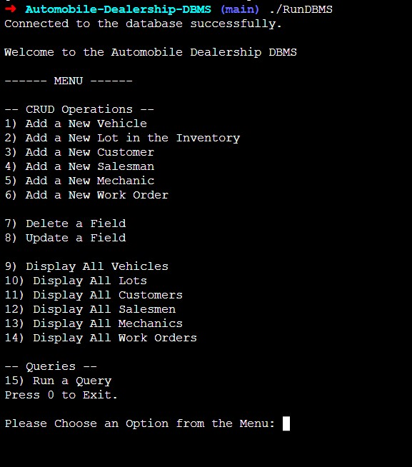
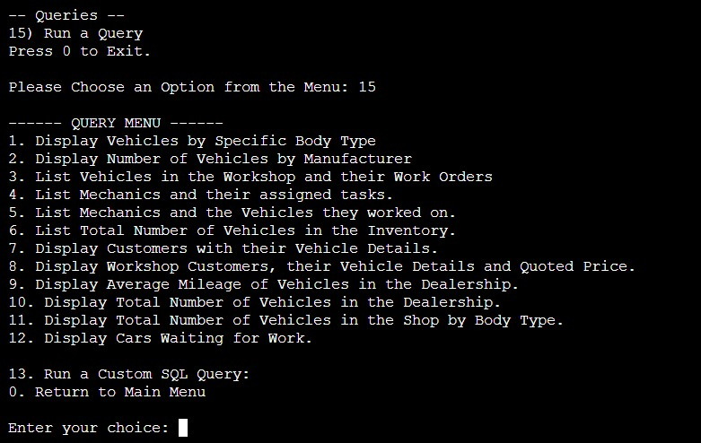

<br />
<div align="center">
  <a href="https://afrokk.github.io/Vintage-Autohaus/">
    
  </a>

  <h3 align="center">Automobile Dealership DBMS</h3>

  <p align="center">
    Streamline Your Automobile Dealership - Get Your Cars On The Road Faster!
    <br />
    <a href="https://github.com/Afrokk/Automobile-Dealership-DBMS/blob/main/Documentation/Demo.pdf"><strong>Documentation »</strong></a>
    <br />
  </p>
</div>

## About The Project

A Database Management System using SQL for an Automobile Dealership. Keeps track of active inventory, customers, repairs, work orders, and much more. Ideal for a small sized dealership - simple & lightweight.

## Database Design (ERD)
<p align="center">
  
</p>

Useful links: [ERD Documentation](https://github.com/Afrokk/Automobile-Dealership-DBMS/blob/main/Documentation/ERDDocumentation.pdf), [Schema Documentation](https://github.com/Afrokk/Automobile-Dealership-DBMS/blob/main/Documentation/SchemaDocumentation.pdf).

## Built With

Built with C, using SQLite3 database. 

* [![SQLite][SQLite.com]][SQLite-url]
* [![C][C.com]][C-url]
* [![Shell][Shell.com]][Shell-url]

## Features

* Fully manipulatable using built-in CRUD functions.
* Serverless. 
* Complete Error Handling.
* 12 built-in queries, with the ability to run any custom SQL query.
* Uses Dynamic Memory Allocation.
* Streamlined compilation using Shell.
* [Documentation](https://github.com/Afrokk/Automobile-Dealership-DBMS/tree/main/Documentation)

## Setup

Here's how to setup this database for personal use.

### Prerequisites

You need to setup C and SQLite3 library for C. Use the following commands to configure both:

* C
  ```sh
  sudo apt install GCC
* SQLite3
  ```sh
  sudo apt-get install libsqlite3-dev 

### Installation & Usage
Use `gcc --version` and `sqlite3 --version` to verify that both C and SQLite3 are setup properly.

1. Clone this repository:
   ```sh
   git clone https://github.com/Afrokk/Automobile-Dealership-DBMS
   ```

  The repository already comes with a blank database `AutomobileDatabase.db` which you can use as a foundation. 

2. Compile/Build the program by running this command in the root directory of the clone: 
    ```sh
    make
    ```
  
3. Run the Automobile Dealership DBMS by running this command:
    ```sh
    ./RunDBMS
    ```
4. For more help, read the usage [documentation](https://github.com/Afrokk/Automobile-Dealership-DBMS/blob/main/Documentation/Demo.pdf) and [query documentation](https://github.com/Afrokk/Automobile-Dealership-DBMS/blob/main/Documentation/QueryDocumentation.pdf).

Note: If you would like to change the name of the default database file (`AutomobileDatabase.db`), you can do so. However, don't forget to change the name of the database file in `AutomobileDealershipDBMS.c` file too, or the database will fail to load or load the wrong database file. 

e.g. Change the line#20 in `AutomobileDealershipDBMS.c` file from:
  ```c
    *ErrMsg = (int)sqlite3_open_v2("AutomobileDatabase.db", &db, SQLITE_OPEN_READWRITE, NULL) * sizeof(int);
  ```
  To:
  ```c
    *ErrMsg = (int)sqlite3_open_v2("**NAME OF YOUR DATABASE FILE**", &db, SQLITE_OPEN_READWRITE, NULL) * sizeof(int);
  ```

## Design
The program runs via the console:

<p align="center">
  
</p>

The user can navigate using the menu. 

<p align="center">
  
</p>

## To-Do
Some of the things I'd like to do with this project, as I work on it:

- [x] Setup database schema and ERD.
- [x] Setup SQLite.
- [x] Add Basic CRUD Functions.
- [x] Add Custom Queries.
- [x] Optimize. - PROJECT COMPLETED.

## Contact

Afrasiyab (Afrokk) Khan - [@afrokk_](https://www.instagram.com/afrokk_/) - [afrokk.design](https://afrokk.design/) - [afrokk.dev](https://afrokk.dev/) - [LinkedIn](https://www.linkedin.com/in/afrasiyab-k/) - afrasiyabkhan379@gmail.com

Project Link: [https://github.com/Afrokk/Automobile-Dealership-DBMS](https://github.com/Afrokk/Automobile-Dealership-DBMS)

[SQLite.com]: https://img.shields.io/badge/sqlite-%2307405e.svg?style=for-the-badge&logo=sqlite&logoColor=white
[SQLite-url]: https://www.sqlite.org/index.html
[C.com]: https://img.shields.io/badge/c-%2300599C.svg?style=for-the-badge&logo=c&logoColor=white
[C-url]: https://en.wikipedia.org/wiki/C_(programming_language)
[Shell.com]: https://img.shields.io/badge/shell_script-%23121011.svg?style=for-the-badge&logo=gnu-bash&logoColor=white
[Shell-url]: https://www.shellscript.sh/
